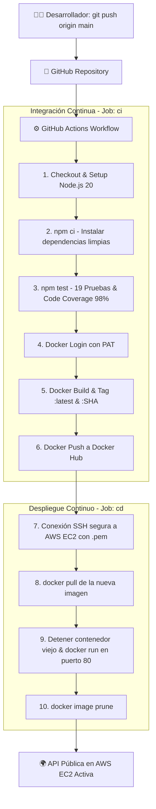

# 🚀 Proyecto de Gestión DevOps: Pipeline CI/CD con GitHub Actions, Docker Hub y AWS EC2

[](https://github.com/josuearreola/gestdevops/actions/workflows/main.yml)

API RESTful desarrollada con **Node.js** y **Express**, contenedorizada con **Docker**, respaldada por un conjunto completo de pruebas unitarias y de integración (con reporte de cobertura de código superior al 70%), y desplegada automáticamente en una instancia **AWS EC2 (Ubuntu)** mediante un pipeline automatizado de **GitHub Actions**.

---

## 🌐 URL Pública de la API en Producción

La API se encuentra activa y escuchando en el puerto HTTP estándar (80) de la instancia EC2:

- **Health Check**: [http://52.14.88.25/api/health](http://52.14.88.25/api/health)
- **Estado del Sistema**: [http://52.14.88.25/api/status](http://52.14.88.25/api/status)
- **Listar Usuarios**: [http://52.14.88.25/api/users](http://52.14.88.25/api/users)
- **Métricas del Sistema**: [http://52.14.88.25/api/metrics](http://52.14.88.25/api/metrics)

---

## 🏛️ Arquitectura del Pipeline CI/CD

El flujo implementa integración y despliegue continuos basados en las mejores prácticas de la industria:



---

## 🛠️ Tecnologías Empleadas

- **Backend**: Node.js v20, Express, CORS.
- **Testing**: Node.js Test Runner nativo (`node:test`, `node:assert`) con motor V8 Coverage (`--experimental-test-coverage`).
- **Contenedores**: Docker (imagen base liviana `node:20-alpine`).
- **Registro de Imágenes**: Docker Hub (`josueas/gestdevops-api`).
- **Orquestación CI/CD**: GitHub Actions.
- **Infraestructura Cloud**: AWS EC2 (Ubuntu Server 24.04/22.04 LTS, Security Groups para puertos 22 SSH y 80 HTTP).

---

## 📋 Catálogo de Endpoints de la API

La aplicación cuenta con 11 endpoints funcionales que cubren operaciones CRUD, diagnósticos y autenticación:

| Método | Endpoint | Descripción | Códigos HTTP |
| :--- | :--- | :--- | :--- |
| `GET` | `/api/health` | Chequeo de salud del servicio y uptime | `200 OK` |
| `GET` | `/api/status` | Diagnóstico de estado del sistema | `200 OK` |
| `GET` | `/api/users` | Listado general de usuarios registrados | `200 OK` |
| `GET` | `/api/users/:id` | Consulta de un usuario específico por ID | `200 OK`, `404 Not Found` |
| `GET` | `/api/metrics` | Métricas de uso de CPU, memoria y ambiente | `200 OK` |
| `POST` | `/api/users` | Registro de un nuevo usuario | `201 Created`, `400 Bad Request` |
| `POST` | `/api/login` | Autenticación con credenciales | `200 OK`, `401 Unauthorized` |
| `PUT` | `/api/users/:id` | Actualización de datos de un usuario | `200 OK`, `400 Bad Request` |
| `PUT` | `/api/settings` | Modificación de ajustes del sistema | `200 OK`, `400 Bad Request` |
| `DELETE` | `/api/users/:id` | Eliminación de usuario | `200 OK`, `404 Not Found` |
| `DELETE` | `/api/cache` | Purga de caché del servidor | `200 OK` |

---

## 🧪 Pruebas Automatizadas y Cobertura de Código

El proyecto cuenta con **19 pruebas automatizadas** que evalúan tanto casos de éxito (*happy paths*) como de manejo de errores (*unhappy paths*).

### Umbral de Cobertura Exigido vs Obtenido:
- **Exigencia mínima**: 70%
- **Resultado Obtenido**:
  - Líneas (`line %`): **98.00%**
  - Ramas (`branch %`): **80.77%**
  - Funciones (`funcs %`): **92.31%**

### Ejecución de Pruebas Localmente:
```bash
# Ejecutar suite de pruebas con reporter y cobertura
npm test
```

---

## 🐳 Contenedorización con Docker

El archivo `Dockerfile` está optimizado para entornos de producción mediante:
1. Imagen mínima `node:20-alpine` (tamaño total de solo **47.5 MB**).
2. Uso de `npm ci --omit=dev` para omitir herramientas de testing en producción.
3. Principio de mínimo privilegio ejecutando con el usuario sin privilegios `USER node`.
4. Archivo `.dockerignore` para excluir dependencias locales, logs y secretos.

### Comandos de Docker Local:
```bash
# Compilar imagen localmente
docker build -t gestdevops-api:latest .

# Ejecutar contenedor mapeando puerto local 3000
docker run -d -p 3000:3000 --name mi-api gestdevops-api:latest

# Probar funcionamiento
curl http://localhost:3000/api/health
```

---

## 🔒 Gestión de Secretos (GitHub Secrets)

Siguiendo las mejores prácticas de DevSecOps, ninguna credencial, clave privada o IP sensible está expuesta en el código fuente:

| Nombre del Secreto | Propósito |
| :--- | :--- |
| `DOCKER_USERNAME` | Usuario de Docker Hub |
| `DOCKER_TOKEN` | Personal Access Token (PAT) de Docker Hub con permisos Read & Write |
| `DOCKER_REPO` | Nombre del repositorio de imágenes en Docker Hub (`gestdevops-api`) |
| `EC2_HOST` | Dirección IPv4 pública de la instancia AWS EC2 |
| `EC2_USER` | Usuario administrador de la máquina (`ubuntu`) |
| `EC2_SSH_KEY` | Contenido de la clave privada SSH (`.pem`) provista por AWS |

---

## ☁️ Configuración de la Instancia AWS EC2

1. **Instancia**: Ubuntu Server 64-bit (x86_64) en tipo `t3.micro` / `t2.micro`.
2. **Grupo de Seguridad (Security Group)**:
   - Regla 1: **SSH (TCP 22)** desde `0.0.0.0/0` para administración y despliegue por GitHub Actions.
   - Regla 2: **HTTP (TCP 80)** desde `0.0.0.0/0` para acceso público a la API.
3. **Instalación de Docker**:
   ```bash
   sudo apt-get update -y
   sudo apt-get install -y docker.io
   sudo systemctl enable --now docker
   sudo usermod -aG docker ubuntu
   sudo chmod 666 /var/run/docker.sock
   ```

---

## 🔄 Demostración del Despliegue Continuo (En Vivo)

Para comprobar el ciclo completo de CD:
1. Realizar una modificación en el código (por ejemplo, cambiar un mensaje de bienvenida o versión en `index.js`).
2. Hacer commit y push a la rama `main`:
   ```bash
   git add .
   git commit -m "chore: test live auto deployment"
   git push origin main
   ```
3. GitHub Actions ejecutará las pruebas, subirá la nueva versión con el commit SHA a Docker Hub, y refrescará el contenedor en la EC2 sin intervención manual.
4. Consultar la IP pública `http://52.14.88.25/api/health` para validar los cambios reflejados al instante.
